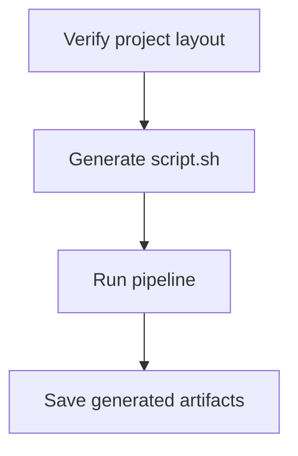

# API


## CLI


Say I have a Ploomber project (with a pipeline.yaml file) in /some/project
and I configure all output generated by that pipeline to be saved in
/some/project/output

Running this:

```sh
soopervisor /some/project /some/folder
```

Should run the project in a temporary directory, then copy the generated
contents in output/ to /some/folder/{hash}, where {hash} is the commit hash
for the current commit in /some/project

Users can configure behavior by adding a soopervisor.yaml file.

Running this:

```sh
soopervisor /some/project /some/folder
```

With a soopervisor.yaml:

```
docker: true
```

Should to the same but run the project inside a local docker container

And this:

```sh
soopervisor /some/project
```

```yaml
upload: true
```

Should upload the generated output/ to box (load credentials from ~/.box)

```
glob: [*.ipynb, *.csv]
```

```sh
# only upload jupyter notebooks and csv files
soopervisor /some/project
```

## Workflow




## 


## A few comments

* Use docker-py for connecting to docker containers https://github.com/docker/docker-py
